<p align="center">
  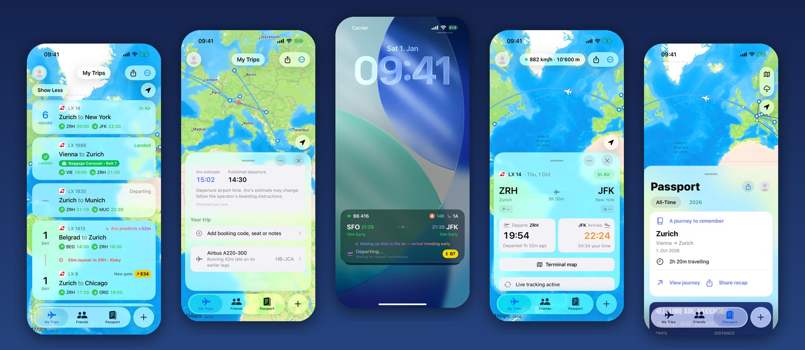
</p>

<h1 align="center">Arc</h1>

<p align="center">
  <b>An iOS travel companion that knows your flight is late before the airline says so.</b><br>
  Flights, trains and ferries · live tracking · AI-assisted · built natively for iOS 26
</p>

<p align="center">
  
  
  
  
  
</p>

---

## What Arc is

Arc tracks the trips you take (flights, trains and ferries) and turns raw
operational data into answers a traveller actually needs. *Will I make my
connection? Is my plane even here yet? Which gate am I walking to?*

Most flight trackers repeat what the airline publishes. Arc works out
what will happen next. It follows **the aircraft itself** through its whole
day. When the plane that will fly your evening flight is running late three
airports away, Arc does the arithmetic, predicts your delay, and tells you,
often well before the airline updates its own departure board.

It is built around one rule: **Arc never claims something nobody told it.**
Every number on screen carries where it came from. A prediction is visibly
Arc's own (it wears ✨ sparkles and the word "Arc"), never dressed up as an
official "On Time". A published ferry timetable gets no delay colour, because
no source reports ferry delays.

---

## ✨ Prediction: knowing before the airline does

<table>
  <tr>
    <td width="33%">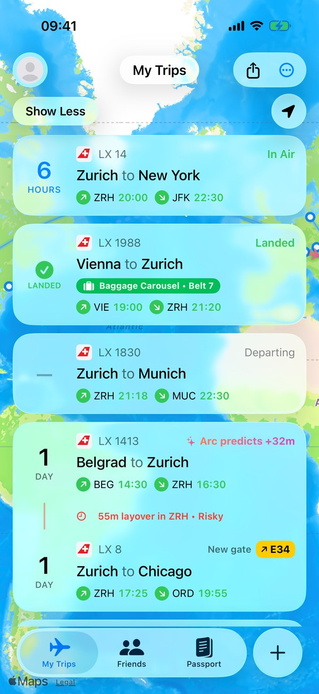</td>
    <td width="33%">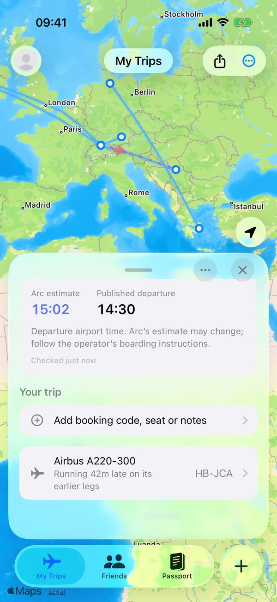</td>
    <td width="33%">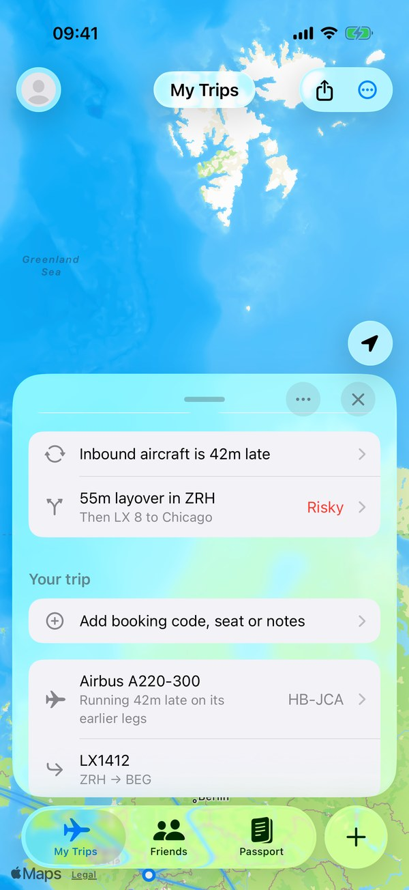</td>
  </tr>
  <tr>
    <td>The airline still says <i>On Time</i>. Arc says <b>+32m</b>.</td>
    <td>Arc's estimate next to the published time, never instead of it.</td>
    <td>The reasoning: the inbound aircraft and its earlier legs.</td>
  </tr>
</table>

**Knock-on delay prediction** (`Arc/Services/RotationChain.swift`, `InboundMonitor.swift`)
- Looks up the aircraft by registration and rebuilds **the tail's entire day**:
  every leg it flies before it becomes *your* flight.
- Propagates lateness through the chain. It accounts for en-route recovery
  (schedules carry padding, so a 40-minute-late departure rarely lands 40 late),
  the minimum turnaround for that aircraft type, and live **ADS-B position** of
  the inbound plane when it is airborne.
- Speaks only when it beats the official number by a meaningful margin
  (≥10 min). Silence means "nothing to add", so the alerts stay worth reading.

**Measured, not claimed** (`backend/src/prediction.ts`)
Every prediction is logged when Arc first makes it. The backend later
measures **how many minutes earlier Arc called the delay than the airline
did**, and whether it was right. Late or wrong predictions are counted too and
never averaged away.

**Weather risk** (`Arc/Services/DelayRisk.swift`)
Scores the departure and arrival *airports*, not the route, from live METAR
and the TAF forecast period covering your departure. It uses operational
thresholds (IFR ceilings, crosswind gusts, de-icing) and says nothing when the
weather is merely unpleasant.

**Gate prediction** (`backend/src/gates.ts`)
Airlines don't publish next month's gates. Arc learns the gate each flight
number tends to use from everything it has tracked, weighting recent sightings
more, so it can estimate the walk for a connection days in advance.

---

## 🤖 AI features

<table>
  <tr>
    <td width="33%">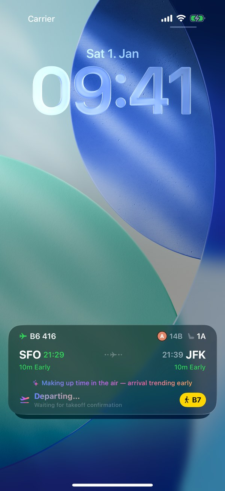</td>
    <td width="33%">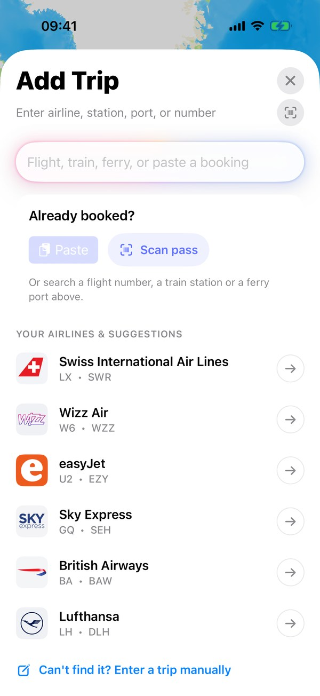</td>
    <td width="33%">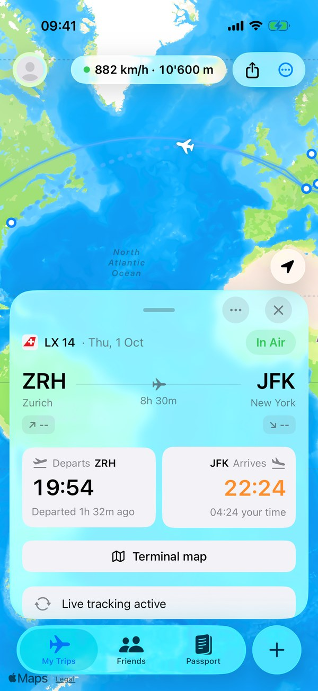</td>
  </tr>
  <tr>
    <td>The Live Activity's <b>smart line</b>, written by Claude.</td>
    <td>Paste a booking email; AI pulls out the flights.</td>
    <td>Live position, speed and altitude from ADS-B.</td>
  </tr>
</table>

**On-device booking extraction with Apple Intelligence** (`Arc/Services/BookingExtractor.swift`)
Paste a forwarded booking confirmation and Arc finds every flight in it.
On a capable iPhone this runs **entirely on-device** with Apple's
*Foundation Models* framework, using guided generation into a typed Swift
structure. The booking never leaves the phone, the answer arrives in about a
second, and it costs nothing. On older devices it falls back to **Claude Haiku**
on the backend.
Every AI answer is then validated: nothing is accepted unless it looks like a
real flight designator with a plausible date, and every flight is checked
against real schedule data before it's added. A small model can hallucinate,
so Arc doesn't trust it blindly.

**Natural-language search** (`Arc/Services/FlightQueryParser.swift`)
"Swiss 1413 tomorrow", "A31653 on the 18th of September", "LX8". A local parser
handles the common cases instantly and offline. Only text it can't resolve is
sent to the AI parser.

**The "smart line" on the lock screen** (`backend/src/index.ts`)
The Live Activity shows times, delay and gate. The smart line adds one
sentence of *understanding*: a delay trend, a knock-on expectation, time
being made up in the air. Claude Haiku phrases it from structured signals.
It is cached by a fingerprint of the situation, so the model runs only when
something actually changes. A normal on-time flight gets no line at all.

**Sensor-based takeoff detection** (`Arc/Services/TakeoffSensor.swift`, `backend/src/ground.ts`)
Airlines publish when the plane leaves the gate. Nobody publishes takeoff. Arc
detects wheels-up from the phone's own sensors: GPS speed above ~80 knots, or
the barometer seeing the cabin climb. On the server it combines ADS-B
evidence with learned, per-airport taxi times (85th percentile by hour of day).

---

## 🗺️ Everything else a traveller needs

<table>
  <tr>
    <td width="25%">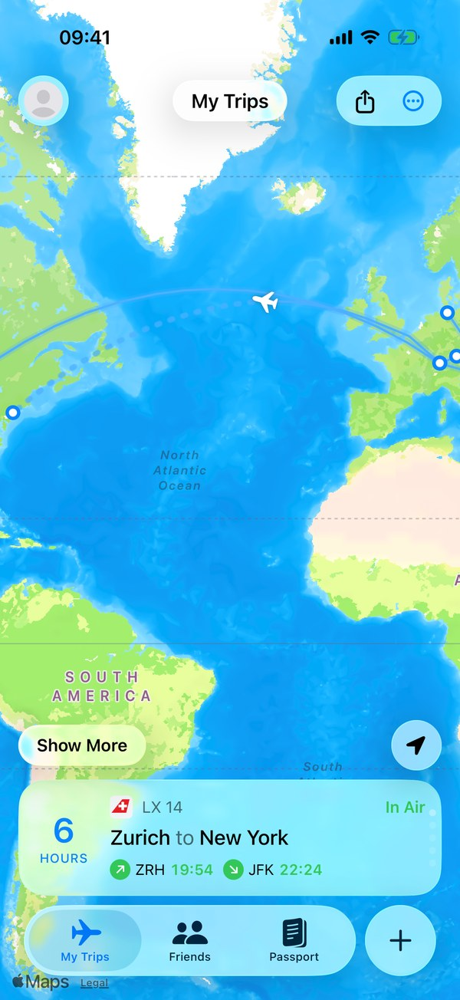</td>
    <td width="25%">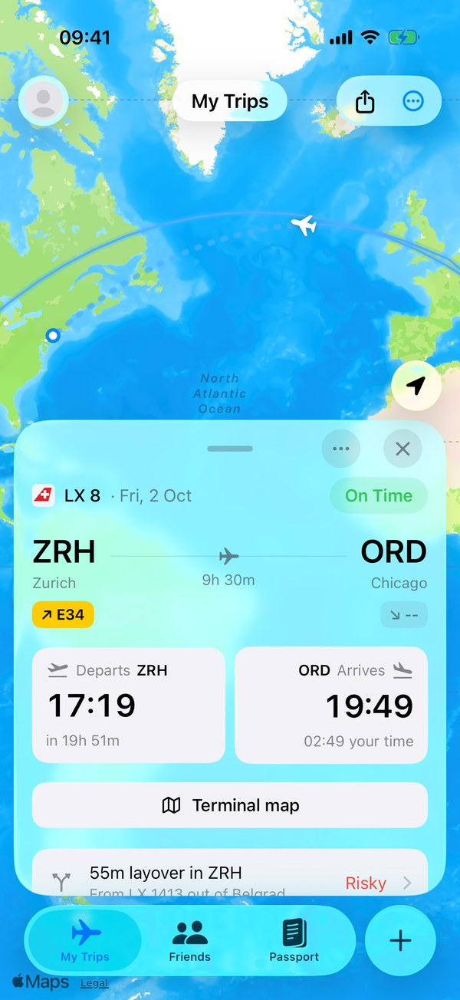</td>
    <td width="25%">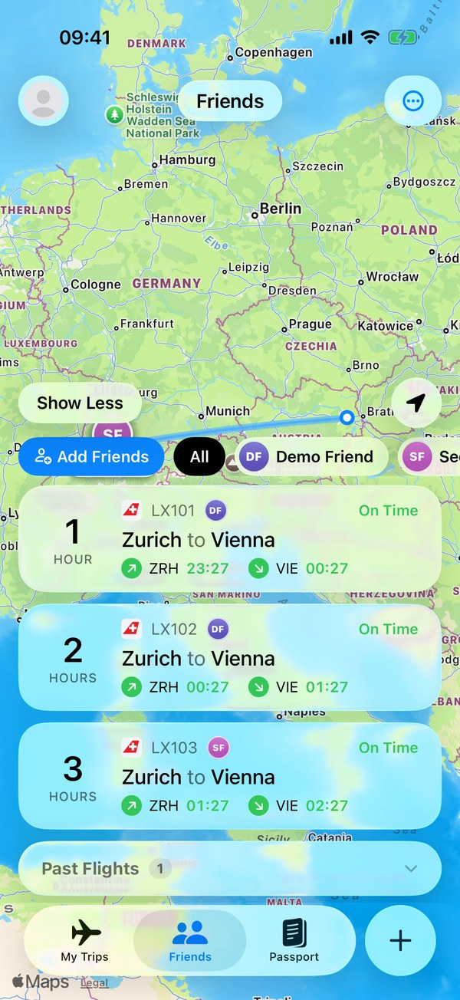</td>
    <td width="25%">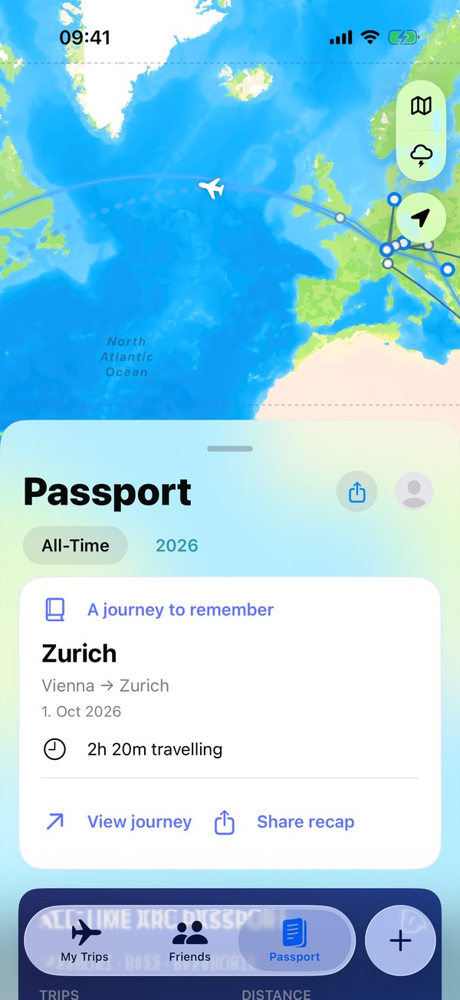</td>
  </tr>
  <tr>
    <td>Live map with flown track and projected path.</td>
    <td>Gate changes and a <b>connection assistant</b> that rates layover risk.</td>
    <td>Friends' trips, shared journeys and "you're both at ZRH" alerts.</td>
    <td>Passport: every trip, recaps and stats.</td>
  </tr>
</table>

- **Connection Assistant**: detects connections, breaks the transfer into
  steps (passport control, security, walking distance between real gates, live
  security queues) and re-rates the risk as delays move the layover.
- **Live Activity and widgets**: a lock-screen and Dynamic Island card that
  keeps counting even with the app closed, updated by remote push.
- **Boarding-pass scanner**: point the camera at any boarding pass. The barcode
  is decoded deterministically, with no network and no AI needed.
- **Trains and ferries**: rail via Transitous/MOTIS with realtime where the
  operator publishes it, ferries via Ferryhopper, each labelled honestly with
  how much its source really knows.
- **Friends**: share trips, see friends' flights on your map, and get alerted
  when you'll be at the same airport.
- **Airport intelligence**: disruption status built from METAR weather, FAA
  NAS status and live security-queue data.
- **Little things**: which side of the plane the sun will be on, baggage belt
  on landing, aircraft details, delay statistics per airline.

<p align="center">
  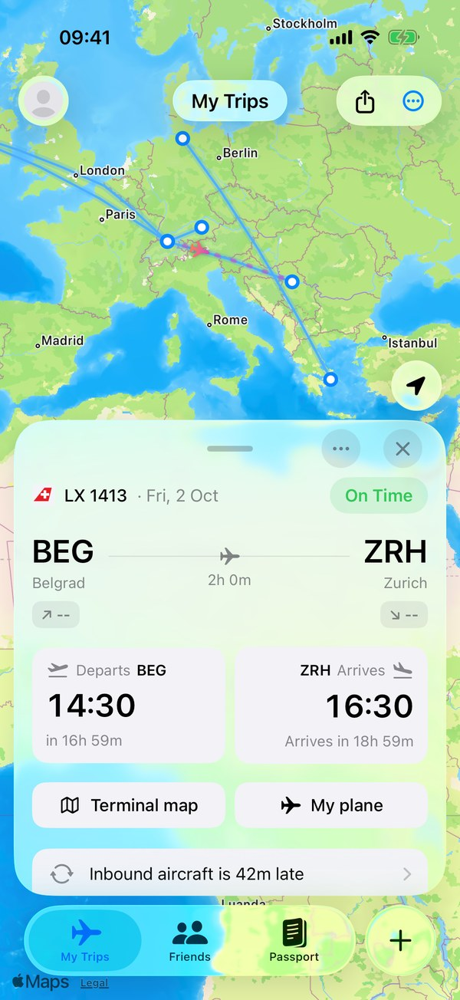
  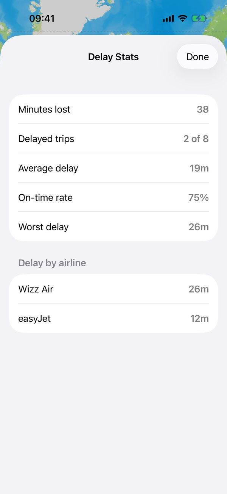
</p>

---

## How it's built

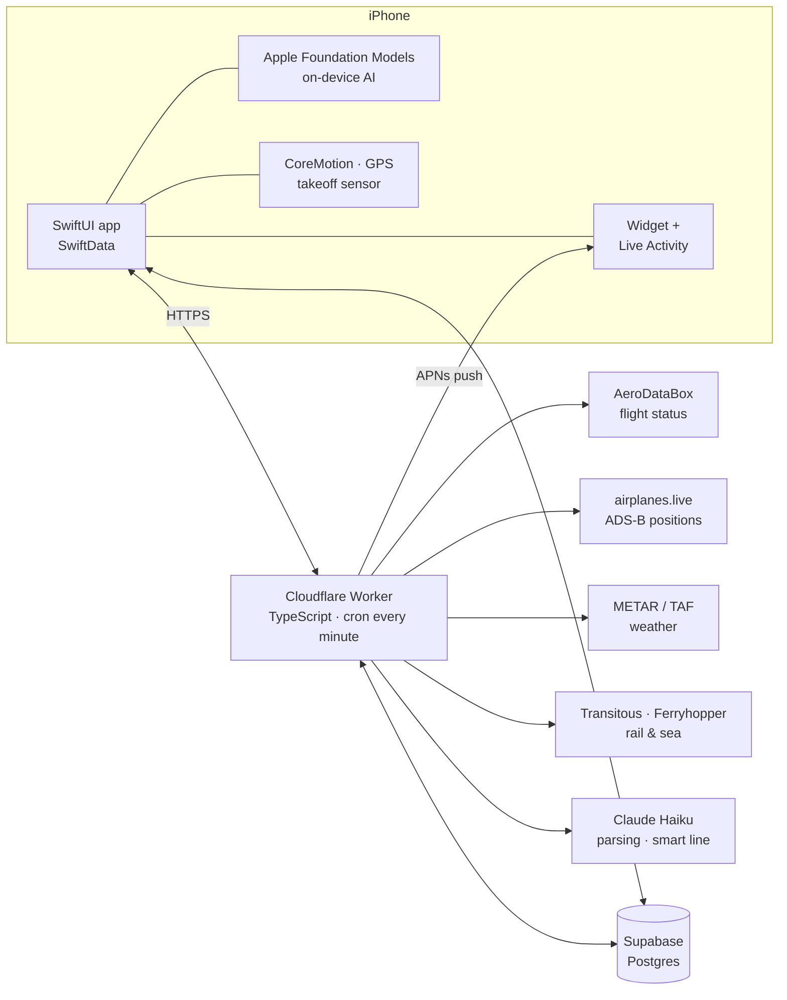

- **App**: SwiftUI + SwiftData, MapKit, ActivityKit, WidgetKit, Foundation
  Models, VisionKit, CoreMotion. About 30,000 lines of Swift.
- **Backend**: a Cloudflare Worker (about 8,500 lines of TypeScript). It holds
  every API key, so **no secret ships in the app**. A per-minute cron watches
  tracked flights, pushes Live Activity updates over APNs, and enforces a
  monthly API budget so the app can run on free tiers.
- **Social layer**: Supabase (Postgres with row-level security) for friends,
  shared journeys, gate observations and prediction measurements.
- **Tested**: 600+ Swift unit and UI tests and 404 backend tests. Prediction,
  gate, ground-state and connection logic are kept in pure, unit-testable modules.
  CI builds the app and runs both suites on every push.

### Project layout

| Path | What's in it |
| --- | --- |
| `Arc/` | The app: SwiftUI views under `Features/`, SwiftData models under `Models/`, prediction, AI and tracking under `Services/` |
| `ArcWidget/` | Home-screen widget and the Live Activity |
| `Shared/` | Compiled into both app and widget: widget snapshot, Live Activity attributes, `arc://` deep links |
| `ArcTests/`, `ArcUITests/` | Unit and UI tests |
| `backend/` | Cloudflare Worker: every provider call, the cron, push, AI calls |
| `supabase/migrations/` | Database schema, in order |
| `scripts/` | Builds the bundled offline airport/airline tables (~7,900 airports, ~990 airlines) |
| `docs/` | Setup guides and the screenshots above |

---

## Running it

Requires **Xcode 26** (iOS 26 deployment target).

```bash
open Arc.xcodeproj        # run the "Arc" scheme
```

Nothing needs configuring to try it. The UI, offline airport/airline search,
manual trip entry, Passport, widgets and Live Activities all work with no
backend and no account. To see the app filled with sample trips, as in the
screenshots, add the launch argument `-seedDemo` to the scheme.

`project.yml` is the source of truth for the Xcode project. Run `xcodegen`
after adding or moving files.

**Tests**

```bash
xcodebuild test -scheme Arc -destination 'platform=iOS Simulator,name=iPhone 17 Pro'
cd backend && npm install && npm test
```

**Backend** (needed only for live search and tracking)

```bash
cd backend
npm run dev       # wrangler dev on http://localhost:8787
npm run deploy
```

`backend/wrangler.toml` documents every secret and what it unlocks. Only an
AeroDataBox key is needed for flight tracking; rail and ferry data need no
key. See [`docs/api-keys-setup.md`](docs/api-keys-setup.md) for a walkthrough.
Point the app at your Worker under Passport → avatar → Settings → Backend URL.

### Data sources

| Mode | Provider | What Arc can honestly claim |
| --- | --- | --- |
| Air | AeroDataBox, AirLabs fallback | Status, revised times, gates, belt, aircraft: **live** |
| Air position | airplanes.live (ADS-B) | Real position while airborne |
| Rail | Transitous / MOTIS | Live where the operator publishes realtime, otherwise **scheduled** |
| Sea | Ferryhopper | Timetable plus disruption notices: always **scheduled** |
| Weather | aviationweather.gov | METAR observations and TAF forecasts |
